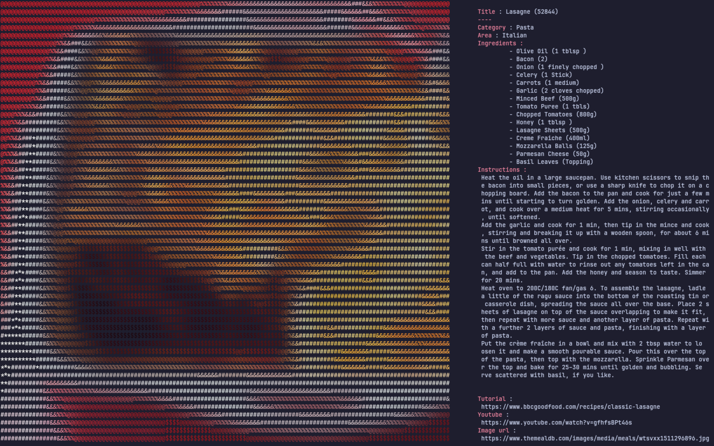

# Foodfetch

Hey,

This project is yet another *fetch* funny (yes it is funny) tools like neofetch, fastfetch, onefetch, countryfetch and all theses.
Except here you fetch food recipe and ideas. It uses the API of [TheMealDB](https://www.themealdb.com/) with the API key of testing. Feel free to go support them to get a real API key.
This is an example of output you can get


## Usage

You can find the options with the argument `--help`
```
Foodfetch - Neofetch-like tool to get recipes
Author: noahcode
Version: 0.1.0
Usage: foodfetch [OPTIONS] [KEYWORD]
Arguments:
  [KEYWORD]
          Keyword to use in the search
Options:
  -i, --infos <INFOS>
          The infos you want to display
          
          [default: all]
          Possible values:
          - all:          Display all available informations
          - links:        Give the links
          - instructions: Give the instructions to cook the meal
  -h, --help
          Print help (see a summary with '-h')
  -V, --version
          Print version
```

## Installation

I've published the package on cratios.io, so you can simply run `cargo install foodfetch`.
Alternatively, if you're on Nix, the package is now in the unstable branch
